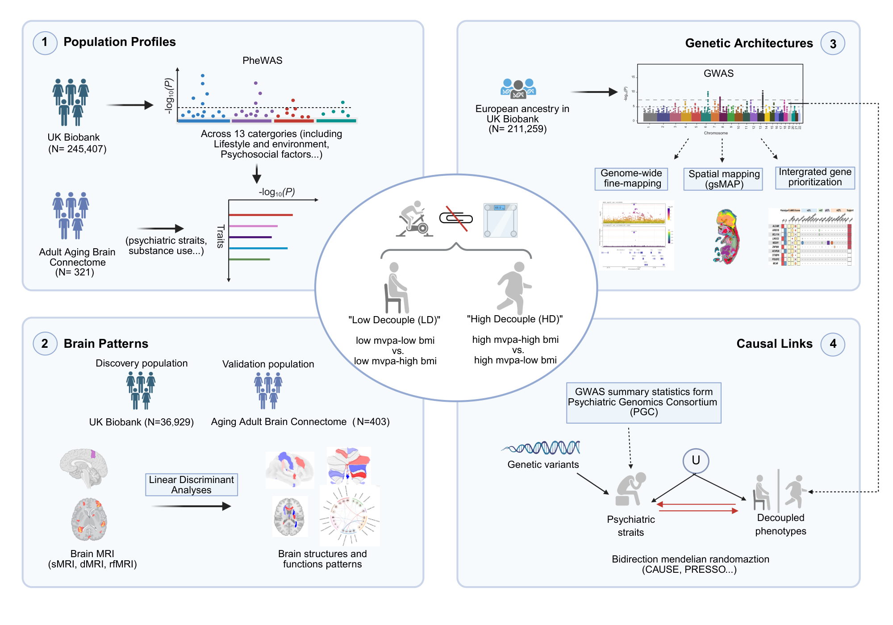

# Brain and genetic architectures of moderate-to-vigorous physical activity–body mass index decoupling with links to mental health

Analysis code for the study of **MVPA–BMI decoupling** in the UK Biobank (UKB) and the Aging Adult Brain Connectome (AABC).

Physical activity is a well-established determinant of body mass index, yet a substantial share of people
break that expected relationship: they are highly active but carry high BMI (**high-decoupled, HD**), or
barely active yet carry low BMI (**low-decoupled, LD**). This repository holds the code used to
characterise the phenomic, neuroimaging, genetic, and causal architecture of those two decoupled states.

Each decoupled group is contrasted against an **MVPA-matched coupled reference** — a control group drawn
from the *same* activity stratum that differs only in BMI. That design is what makes the two contrasts
interpretable as decoupling rather than as activity or adiposity alone.

---

## Study overview



*Figure 1. Study design. (1) Population profiles — phenome-wide association screen across 1,194
phenotypes in UKB (N = 245,407), with mental-health-relevant hits replicated in AABC (N = 321).
(2) Brain patterns — bootstrap linear discriminant analysis of multimodal MRI in UKB (N = 36,929),
validated in AABC (N = 403). (3) Genetic architectures — GWAS in European-ancestry UKB participants
(N = 211,259), followed by genome-wide fine-mapping, spatially resolved heritability mapping, and
integrated effector-gene prioritization. (4) Causal links — bidirectional Mendelian randomization
between the decoupled phenotypes and 17 psychiatric traits from the Psychiatric Genomics Consortium.*

Full-resolution vector version: [figures/Figure1.pdf](figures/Figure1.pdf)

---

## Phenotype definition

MVPA and BMI were harmonised the same way in both cohorts. MVPA came from the IPAQ short form
(UKB fields 22038 + 22039 as MET-min/week; the HCP Lifespan 2.0 IPAQ total in AABC), and BMI from
weight (kg) / height (m)². Both traits were then **sex-stratified, regressed on age and age²**, and the
residuals mapped to standard normal deviates by **rank-based inverse-normal transformation (RINT)**,
giving scores *M* (MVPA) and *B* (BMI).

Four groups follow from a symmetric buffered joint-threshold rule with buffer **b = 0.25**:

| Group | Rule | Role | UKB N | AABC N |
|---|---|---|---:|---:|
| **HD** (high-decoupled) | *M* > b ∧ *B* > b | case | 44,876 | 76 |
| HD-coupled reference | *M* > b ∧ *B* < −b | MVPA-matched control for HD | 61,161 | 88 |
| **LD** (low-decoupled) | *M* < −b ∧ *B* < −b | case | 47,386 | 88 |
| LD-coupled reference | *M* < −b ∧ *B* > b | MVPA-matched control for LD | 57,836 | 69 |

Robustness of the split was assessed across b ∈ {0, 0.05, …, 1.00}. AABC was age-aligned (40–72 y) to UKB.

---

## Repository layout

```
.
├── code/
│   ├── 01_phenome-wide-association/
│   │   └── phwas_PHESANT.sh                  PheWAS across 1,194 UKB phenotypes (PHESANT)
│   ├── 02_brain-imaging/
│   │   ├── Brain_MRI_LDA_analysis_UKB.ipynb  UKB discovery: IDP assembly → deconfound → bootstrap LDA
│   │   └── Brain_MRI_LDA_analysis_AABC.py    AABC replication: regularised bootstrap LDA (sMRI track)
│   ├── 03_genome-wide-association/
│   │   ├── gwas_BOLT_LMM.sh                  GWAS of HD and LD (BOLT-LMM v2.5, non-infinitesimal)
│   │   ├── cojo_GCTA.sh                      Conditional/joint analysis + long-range-LD collapsing
│   │   ├── fine-mapping_GCTB.sh              Genome-wide fine-mapping (GCTB --gwfm, SBayesRC)
│   │   ├── gene_prioritization_FLAMES.sh     Effector-gene prioritization (FLAMES + PoPS + MAGMA)
│   │   └── spatial_mapping_gsMap.sh          Spatially resolved heritability mapping (gsMap)
│   └── 04_mendelian-randomization/
│       ├── run_mr_analysis.sh                Driver for the bidirectional MR pipeline
│       └── mr_pipeline.R                     CAUSE + two-sample MR + MR-PRESSO, both directions
└── figures/
    ├── Figure1.pdf                           Study design (vector)
    └── Figure1.png                           Study design (raster preview, 200 dpi)
```

Directories are numbered in the order the analyses appear in the paper. Each script is standalone —
there is no orchestrating master script, because the stages run on different machines and at very
different time scales (the GWAS and fine-mapping steps are multi-day jobs on a compute node).

---

## Analyses

### 1. Phenome-wide association screen

[`code/01_phenome-wide-association/phwas_PHESANT.sh`](code/01_phenome-wide-association/phwas_PHESANT.sh)

HD and LD were each screened against **1,194 phenotypes spanning 12 categories** using
[PHESANT](https://github.com/MRCIEU/PHESANT), which assigns every raw UKB field a variable type
(continuous, ordinal, binary, unordered categorical) and applies the matching transform and model —
linear, logistic, or multinomial-logistic. Each contrast is case (1) versus its own MVPA-matched coupled
reference (0), adjusted for age, sex, and assessment centre, and run in 20 parallel parts.

Significance threshold: **P < 0.05 / 1,194 / 2 = 2.09 × 10⁻⁵** (−log₁₀P > 4.68), correcting jointly for
the phenotype count and the two decoupled phenotypes tested in parallel.

The script as committed runs the `high_mvpa_bmi_uncouple` contrast; swap `--traitofinterest` and
`--resDir` to the `low_mvpa_bmi_uncouple` values for the LD arm.

### 2. Multivariate brain-imaging signatures

[`code/02_brain-imaging/Brain_MRI_LDA_analysis_UKB.ipynb`](code/02_brain-imaging/Brain_MRI_LDA_analysis_UKB.ipynb) ·
[`code/02_brain-imaging/Brain_MRI_LDA_analysis_AABC.py`](code/02_brain-imaging/Brain_MRI_LDA_analysis_AABC.py)

Imaging-derived phenotypes are strongly correlated within and across modalities, so **linear discriminant
analysis (LDA)** is used rather than mass-univariate testing: it projects the correlated features onto a
subspace maximising between-class separation under a shared within-class covariance, and the resulting
discriminant coefficients index each feature's independent contribution.

Feature sets:

| Cohort | Modality | Features | Parcellation |
|---|---|---:|---|
| UKB | Grey-matter volume | 139 | Harvard–Oxford (111 cortical/subcortical) + Diedrichsen (28 cerebellar) |
| UKB | White-matter FA | 48 | JHU ICBM-DTI-81 tracts |
| UKB | Resting-state FC | 210 | partial-correlation edges among 21 group-ICA components |
| AABC | Grey-matter volume | 381 | HCP-MMP 1.0 (360 cortical) + FreeSurfer aseg (21 subcortical/cerebellar) |
| AABC | Resting-state FC | 153 | Yeo-17 network-level upper triangle over Glasser parcels |

Tract-level FA is not part of AABC Release 2, so the FA track is UKB-only.

The UKB notebook runs end to end: it pulls the sMRI, dMRI, and rs-fMRI field sets from the raw table,
excludes the third imaging visit and rows with missing data, then **z-scores and deconfounds** each
feature matrix against resting- and task-fMRI head motion, grey-matter volume, the four head-position
and scanner-table variables, and assessment-centre dummies (following Elliott et al., 2018), via
`nilearn.signal.clean`. AABC lacks UKB's motion and head-position fields, so the replication substitutes
the available QC metadata: **eTIV plus recruitment-site dummies**.

Class imbalance between decoupled and coupled groups is handled by **class-balanced bootstrap
resampling** — each iteration draws cases and controls with replacement to equal counts matched to the
smaller group, and refits the model. The two cohorts differ deliberately:

|  | UKB | AABC |
|---|---|---|
| Bootstrap iterations | 100 | 500 |
| LDA solver | scikit-learn default (SVD) | `lsqr` with automatic Ledoit–Wolf shrinkage |
| Covariate residualisation | in-fold | in-fold |

The regularisation in AABC is a necessity, not a preference: at p ≈ 381 features against N ≈ 200 per
contrast, the within-class covariance matrix is near-singular under the default solver. Covariates
(age, sex, education, and in AABC also race; in UKB additionally sleep duration, self-rated health,
illness/disability, and weight change) are regressed out **inside each bootstrap fold** rather than up
front, so residualisation is estimated only on the resampled training set and cannot leak class
information into the bootstrap null.

Each feature is summarised by the mean coefficient across iterations and its **5th–95th percentile
interval**; features whose interval excludes zero are reported as robust discriminative contributors.

### 3. Genome-wide association and downstream genomics

Analytical sample: European-ancestry UKB participants assigned by the Pan-UK Biobank Project
(field 30079), after excluding genetic–self-reported sex mismatches.

**GWAS** — [`gwas_BOLT_LMM.sh`](code/03_genome-wide-association/gwas_BOLT_LMM.sh)

BOLT-LMM v2.5 under the non-infinitesimal mixed model (`--lmm --lmmForceNonInf`), which absorbs
population structure and cryptic relatedness into a whole-genome random effect. The random-effect
covariance is built from directly genotyped autosomes; testing is on centrally imputed variants at
**MAF ≥ 1 × 10⁻³ and INFO ≥ 0.3**. Covariates: sex, age, age², age × sex, and the first 20 genetic PCs.
Genome-wide significance at **P < 5 × 10⁻⁸**. HD and LD are run in one loop over `PHENOTYPES`.

SNP-based heritability, the LD-score intercept, and the attenuation ratio were then estimated with LDSC
against 1000 Genomes Phase 3 European LD scores.

**Conditional analysis** — [`cojo_GCTA.sh`](code/03_genome-wide-association/cojo_GCTA.sh)

GCTA-COJO `--cojo-slct` per chromosome (MAF 0.01, 10-Mb window, collinearity 0.9) against an unrelated
European UKB LD reference, then three post-processing steps: merge across chromosomes; **collapse
surplus signals inside 24 catalogued long-range high-LD regions** (hg19; Price et al. 2008, Anderson
et al. 2010) keeping the best joint P per region; and filter to index SNPs whose original GWAS
P < 5 × 10⁻⁸.

A design-driven sign filter is applied on top. Because HD cases and controls sit in the same high-MVPA
stratum and differ only in BMI — and LD is defined symmetrically in the low-MVPA stratum — BMI is the
only trait separating cases from controls within a contrast. Any genuine locus must therefore be a
BMI-affecting locus with the concordant direction, so lead and conditionally independent SNPs were
retained only when genome-wide significant and directionally concordant in an independent BMI GWAS
(HD-risk alleles BMI-increasing, LD-risk alleles BMI-decreasing).

**Fine-mapping** — [`fine-mapping_GCTB.sh`](code/03_genome-wide-association/fine-mapping_GCTB.sh)

Genome-wide fine-mapping with GCTB `--gwfm RC`, built on the SBayesRC hierarchical multi-component
mixture model. Unlike region-based approaches such as FINEMAP, this jointly integrates genome-wide
functional annotation and LD in a single pass. Inputs: GCTB's precomputed eigen-decomposition LD
reference, and 96 genomic annotations from Gazal et al. Variants at **PIP ≥ 0.9** are treated as likely
causal; 90% credible sets are derived from ranked PIPs.

**Gene prioritization** — [`gene_prioritization_FLAMES.sh`](code/03_genome-wide-association/gene_prioritization_FLAMES.sh)

FLAMES, a supervised framework combining two evidence streams: locus-level SNP-to-gene functional
annotation (eQTL, enhancer, VEP consequence, CADD) and **PoPS** gene-level genome-wide convergence.
Runs in two stages — `annotate` with local VEP cache and CADD whole-genome SNV scores, then `FLAMES`
scoring. Genes above a **cumulative precision threshold of 0.75** are retained as effector genes. The
file contains both the HD and LD invocations, differing only in `PROJECT_DIR`.

Effector genes were complemented by SMR with the HEIDI heterogeneity test (run through SMR-Portal) to
separate shared-causal-variant pleiotropy from linkage-driven co-localisation, and the prioritised gene
sets were taken forward to g:Profiler GO enrichment (BH-FDR < 0.05), an Enrichment Map (Jaccard > 0.25,
Louvain resolution 2.0), and BrainSpan developmental-trajectory clustering (k-means, k = 2 by
silhouette; GAM-smoothed).

**Spatial heritability mapping** — [`spatial_mapping_gsMap.sh`](code/03_genome-wide-association/spatial_mapping_gsMap.sh)

gsMap localises where in tissue the associated variants act. It computes a gene-specificity score per
spatial-transcriptomic spot, propagates spot scores to SNPs within **50 kb of each gene's TSS**, and runs
S-LDSC on the resulting spot-level annotations; spot P-values are aggregated to tissue/cell-type level by
**Cauchy combination**. The committed script covers the human embryo atlas — six Carnegie-stage 20/23
whole-embryo sections at `bin50` `substructure` resolution (81 substructures), with a shared slice mean
computed first (`create_slice_mean`) so per-sample gene specificity is comparable across sections, then
steps 1–6 per sample and a final cross-sample Cauchy combination. The second block re-runs a single
section (`CS23_E2S10`) reusing the existing slice mean; that section is the one reported in the paper.
The parallel mouse E16.5 whole-brain analysis follows the same call sequence, restricted to one-to-one
human–mouse orthologues from Ensembl BioMart.

Adult-tissue validation used LDSC-SEG across six independent reference panels (GTEx, GTEx brain, Cahoy,
Franke, ImmGen, Roadmap), with FDR < 0.05 within panel; tissues enriched in both gsMap and at least one
LDSC-SEG panel were treated as robustly implicated.

### 4. Bidirectional Mendelian randomization

[`code/04_mendelian-randomization/run_mr_analysis.sh`](code/04_mendelian-randomization/run_mr_analysis.sh) ·
[`code/04_mendelian-randomization/mr_pipeline.R`](code/04_mendelian-randomization/mr_pipeline.R)

Both directions are tested for every pair of {HD, LD} × 17 psychiatric traits — 11 individual PGC
disorders (ADHD, PTSD, MDD, ANX, AUDIT_P, CUD, SCZ, BIP, OCD, ASD, AN) plus 6 higher-order factors from
the 14-disorder hierarchical genomic factor model (PFactor and F1 Compulsive, F2 Psychotic/SCZ-BIP,
F3 Neurodevelopmental, F4 Internalizing, F5 Substance-use). Genetic correlations were estimated
separately by LDSC v1.0.1 on HapMap3 variants with the European 1000 Genomes reference.

Two MR frameworks are run because their assumptions do not overlap:

**CAUSE** (primary) jointly models correlated and uncorrelated horizontal pleiotropy from genome-wide
summary statistics and returns posterior probabilities for the causal versus sharing model. Candidate
instruments are LD-pruned at **r² < 0.1 in a 10-Mb window**. The exposure P-value threshold is
**1 × 10⁻³**, tightened to **1 × 10⁻⁴** for PTSD, AUDIT_P, and ANX where the default destabilised the
model, with a hard cap of **2,000 posterior SNPs** (top by P) to keep the posterior tractable.

**Two-sample MR** (sensitivity) uses genome-wide-significant, LD-independent instruments
(**P < 5 × 10⁻⁸, r² < 0.001, 10-Mb window**) against the 1000 Genomes European panel via `TwoSampleMR`
and `MRPRESSO`. IVW is the primary estimator; weighted median, weighted mode, and MR-Egger are reported
as pleiotropy-robust sensitivity analyses. MR-PRESSO detects and corrects outliers, and leave-one-out
identifies overly influential instruments. Instrument strength is summarised by R² and the F-statistic,
and Steiger filtering removes variants whose direction of effect is inconsistent.

A causal claim required **directionally concordant evidence from both**: CAUSE posterior support for the
causal over the sharing model, and IVW MR robust to MR-PRESSO outlier correction.

Practical details worth knowing before re-running, all handled in `mr_pipeline.R`:

- **Resume-safe.** Both directions of a pair are pre-checked before any heavy I/O, and completed pairs
  load their cached summaries instead of recomputing. Parsed GWAS are cached as `.rds`, instruments as
  `.tsv`.
- **Wall-clock timeouts.** `cause()` is capped at 120 min and `est_cause_params()` at 90 min, using
  elapsed time only (`cpu = Inf`) so multi-threaded BLAS does not trip a CPU-time limit spuriously.
- **Instrument fallback.** If a pair yields fewer than 3 usable SNPs at P < 5 × 10⁻⁸ after harmonisation
  and Steiger filtering, the exposure is re-extracted at P < 1 × 10⁻⁵ and the pair retried.
- **Extreme-value cleaning.** Before nuisance estimation, merged CAUSE datasets drop variants with
  |z| > 38, non-finite estimates, or standard errors outside (1 × 10⁻⁴, 10). Pairs with fewer than
  10⁵ overlapping SNPs are skipped.
- Effect sizes are harmonised across input formats — beta/SE, log(OR)/SE, or Z with SE fixed at 1 — and
  variants are filtered at INFO ≥ 0.8 where an INFO column exists.

---

## Software

| Tool | Version | Used for |
|---|---|---|
| [BOLT-LMM](https://alkesgroup.broadinstitute.org/BOLT-LMM/) | v2.5 | GWAS, non-infinitesimal mixed model |
| [GCTA](https://yanglab.westlake.edu.cn/software/gcta/) | COJO | conditional and joint analysis |
| [GCTB](https://cnsgenomics.com/software/gctb/) | `--gwfm RC` (SBayesRC) | genome-wide fine-mapping |
| [LDSC](https://github.com/bulik/ldsc) | v1.0.1 | heritability, genetic correlation, LDSC-SEG |
| [gsMap](https://github.com/LeonSong1995/gsMap) | — | spatially resolved heritability mapping |
| [FLAMES](https://github.com/Marijn-Schipper/FLAMES) | — | effector-gene prioritization |
| PoPS · MAGMA · VEP · CADD | — | FLAMES input evidence streams |
| [PHESANT](https://github.com/MRCIEU/PHESANT) | — | phenome-wide association screen |
| [SMR-Portal](https://yanglab.westlake.edu.cn/software/smr_portal/) | — | SMR + HEIDI |
| [g:Profiler](https://biit.cs.ut.ee/gprofiler/) | — | GO enrichment |
| PLINK | 1.9 | LD clumping and pruning for MR |

R packages: `TwoSampleMR`, `MRPRESSO`, `cause`, `ieugwasr`, `data.table`, `dplyr`, `optparse`,
`R.utils`, `ggplot2`.
Python packages: `pandas`, `numpy`, `scikit-learn`, `nilearn`.

Reference data not included here: 1000 Genomes Phase 3 European LD panel, HapMap3 variant list,
BOLT-LMM European LD scores and recombination map, GCTB eigen-decomposition LD reference, the Gazal
96-annotation set, GCTA per-chromosome UKB LD reference, VEP cache, CADD whole-genome SNV scores,
gencode v46lift37 annotation, and the ABC/Roadmap enhancer BED.

---

## Reproducing

All paths in these scripts are absolute and point at the compute environment where the analyses were
run. Before re-running anything, edit the path block at the top of each script to match your own layout —
that is the only change most of them need. Concretely:

- `gwas_BOLT_LMM.sh` — `BOLT_CMD`, `IMPUTE_DIR`, `PLINK_BED/BIM/FAM`, `SAMPLE_FILE`, and the LD-score
  and genetic-map table paths.
- `cojo_GCTA.sh` — `GCTA`, `REF_DIR` (expects `ref_chr1` … `ref_chr22`), and the `GWAS_MAP` entries.
- `fine-mapping_GCTB.sh`, `gene_prioritization_FLAMES.sh`, `spatial_mapping_gsMap.sh` — the tool,
  reference, and project directories at the top of each file.
- `run_mr_analysis.sh` — `BASE`, the two MVPA summary-statistic paths, and the GWAS directories; it
  passes everything else to `mr_pipeline.R` as command-line options, so the R script itself needs no
  editing.
- The brain-imaging scripts — `DATA_DIR` in the notebook; `AABC_IDP_DIR`, `AABC_NIMG`, `PHENO_CSV`, and
  `OUT_DIR` in the AABC script.

`run_mr_analysis.sh` also calls `plot_mr_summary.R`, a figure-only helper that is not part of this
repository; drop that final block to run the pipeline itself.

Order of execution: the PheWAS and brain-imaging tracks are independent of each other and of the
genomics track. Within genomics, GWAS must run first, and its summary statistics feed COJO,
fine-mapping, gsMap, and MR. Gene prioritization additionally needs the MAGMA and PoPS outputs to
already exist.

Note that GCTB, gsMap, and BOLT-LMM as configured here request 24–56 threads and substantial memory;
scale `--thread`, `--threads`, `--num_processes`, and `--numThreads` to your hardware.

---

## Data availability

No individual-level data are contained in this repository, and none can be redistributed by us.

UK Biobank data are available to approved researchers through the
[UK Biobank Access Management System](https://www.ukbiobank.ac.uk/enable-your-research/apply-for-access).
This study used applications **55005** and **62663**. AABC data are distributed through the
[NIMH Data Archive / Connectome Coordination Facility](https://www.humanconnectome.org/).
Psychiatric GWAS summary statistics are available from the
[Psychiatric Genomics Consortium](https://pgc.unc.edu/for-researchers/download-results/); cohort
composition, sample sizes, release versions, genome builds, and citations for every input dataset are
listed in Supplementary Table 24 of the paper.

Summary-level results supporting the figures are provided as Source Data and Supplementary Data with the
published article.

---

## Citation

> Zhang J, Huang D, Wang Y, Xu Y, Huang Y, Wang S, Han M, Zhao J, Chen W, Gengzong, Ye D, Wang X, Ma H.
> Brain and genetic architectures of moderate-to-vigorous physical activity–body mass index decoupling
> with links to mental health.

J.Z. and D.H. contributed equally as co-first authors.

Correspondence: Hao Ma (hma@sinh.ac.cn), Xuan Wang (x_wang@fudan.edu.cn), Dongqing Ye (ydqph@aust.edu.cn).

Affiliations: Shanghai Institute of Nutrition and Health, Chinese Academy of Sciences · School of Public
Health, Anhui University of Science and Technology · Institute of Nutrition, School of Public Health,
Fudan University.

---

## Acknowledgements

We thank all participants and professionals contributing to the UK Biobank and the Aging Adult Brain
Connectome. Supported by the Youth Scientist Project (2025YFA1805800) of the National Key Research and
Development Program, the Noncommunicable Chronic Diseases-National Science and Technology Major Project
(2025ZD0550602), and a Fudan University startup grant (IHI2645003Y).
